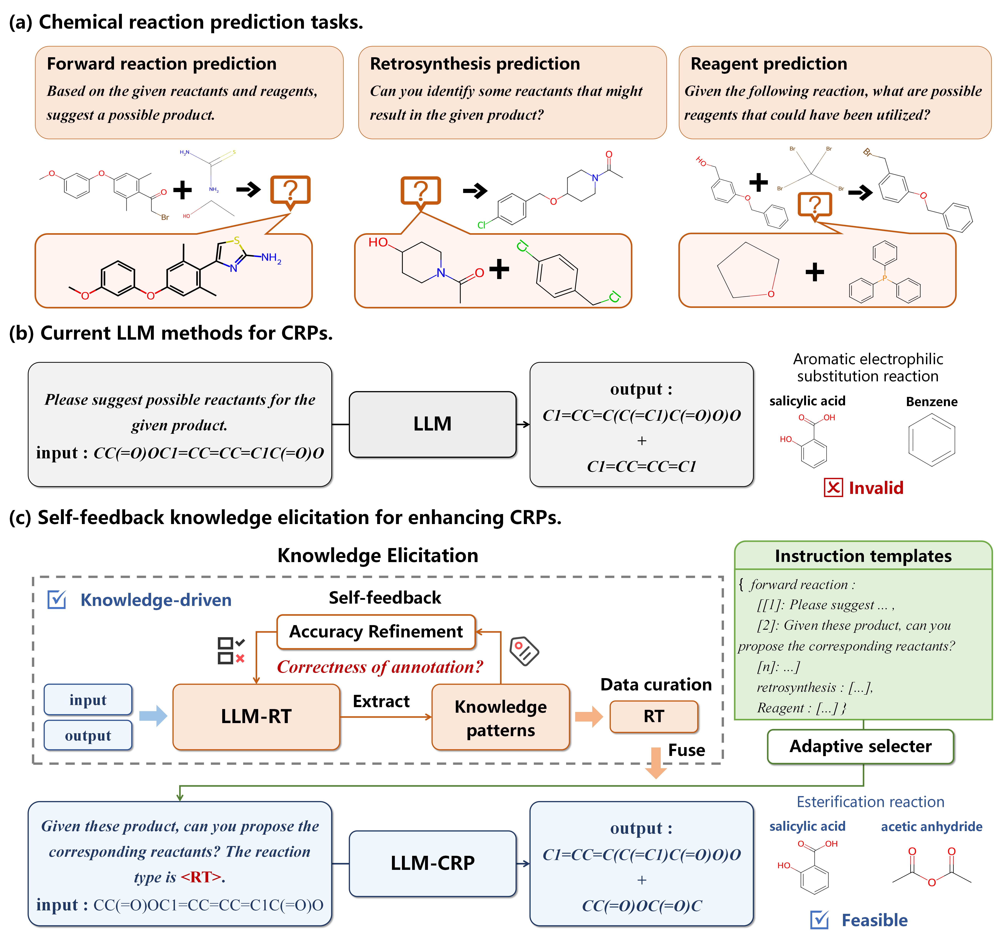
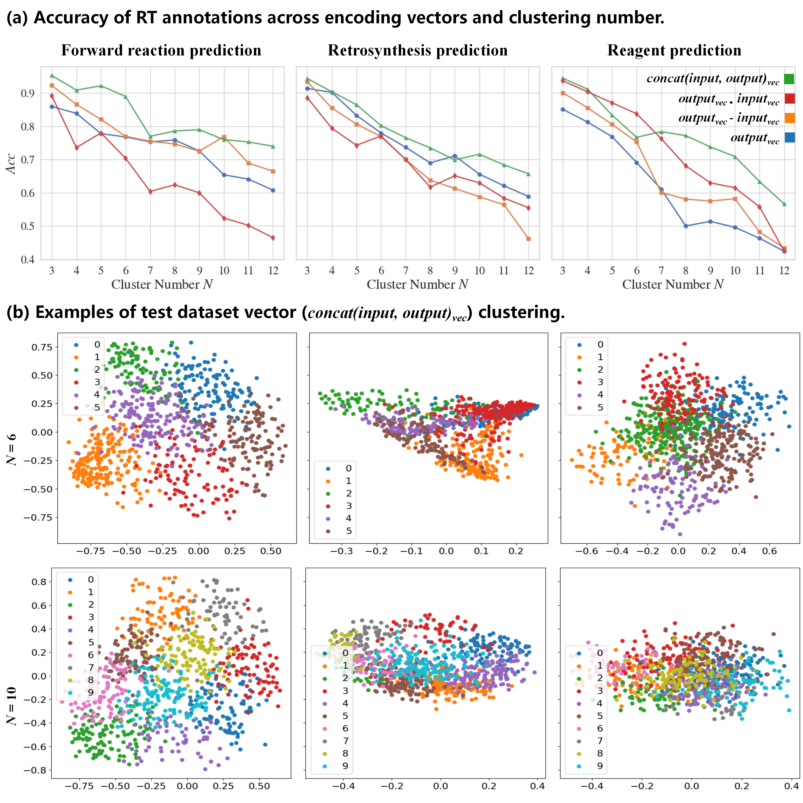
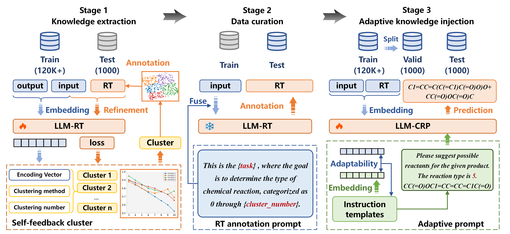
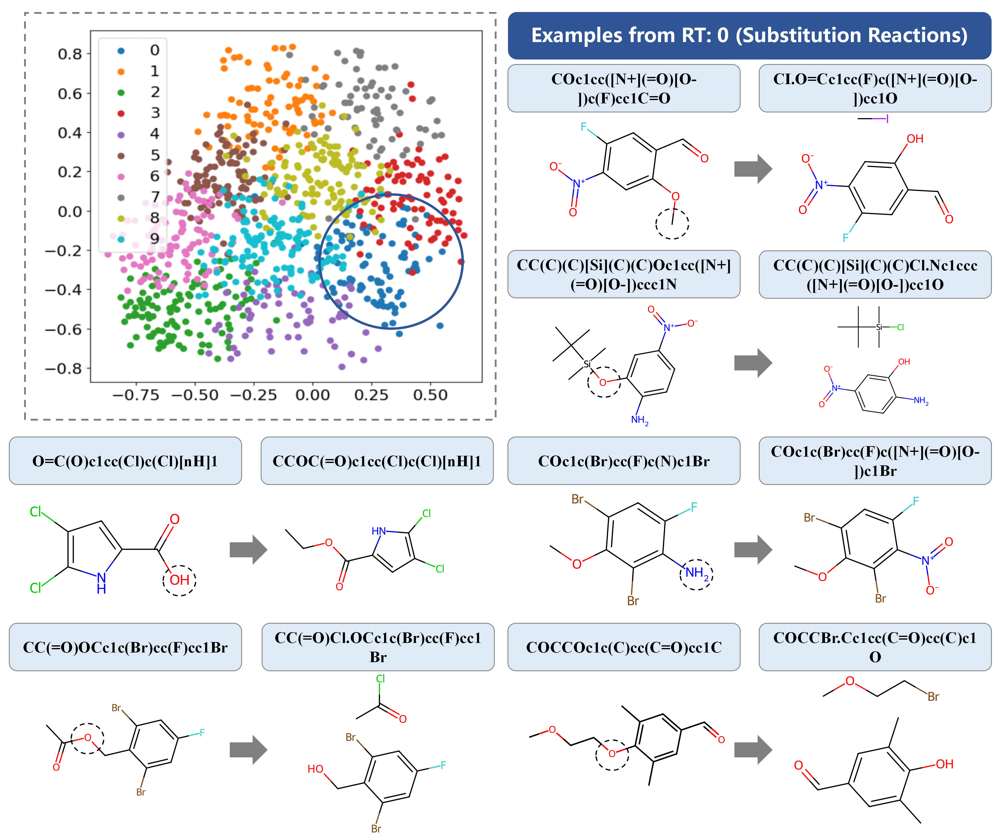

# Scientific Language Modeling (SLM4Mol): A Quantitative Review of Large Language Models in Molecular Science

This analysis offers a comprehensive review of Transformer models and Large Language Models (LLMs) in molecular modeling and design. Large language models (LLMs) offer a fresh approach to tackle scientific problems from a natural language processing (NLP) perspective, introducing a research paradigm called scientific language modeling (SLM). However, two key issues remain: how to quantify the match between model and data modalities and how to identify the knowledge-learning preferences of models. To address these challenges, we propose a multi-modal benchmark, named ChEBI-20-MM, and perform 1263 experiments to assess the model's compatibility with data modalities and knowledge acquisition. Through the modal transition probability matrix, we provide insights into the most suitable modalities for tasks. Furthermore, we introduce a statistically interpretable approach to discover context-specific knowledge mapping by localized feature filtering.



**Paradigm of the Review**:
- **a. Molecular Modeling and Design Tasks**: Showcasing six task types, their standard modeling methods, and data examples.
- **b. Processes of Tasks**: Dividing molecular data into internal and external categories. Internal information is key to molecular representation and can be converted via various tools, while external information is more accessible and comprehensible to humans. This section outlines the research scope, detailing inputs and outputs for each task.

**Note**: The ChEBI-20-MM benchmark and model sections detail respective directories. Some data and checkpoints might not be available due to size constraints and permissions.

## ChEBI-20-MM
We introduce ChEBI-20-MM, a multi-modal benchmark developed from the ChEBI-20 dataset, integrating data like InChI, IUPAC, and images for a diverse range of molecular tasks.

Contents:
- `train.csv` (26,406 records)
- `validation.csv` (3,300 records)
- `test.csv` (3,300 records)
- `image` folder: Molecular images from Pubchem (e.g., `cid.png`)

Download links:
- [ChEBI-20-MM](https://huggingface.co/datasets/liupf/ChEBI-20-MM)
- [MoleculeNet Datasets](https://moleculenet.org/datasets-1)

Visualization of Data Source Suitability and Chemical Space Diversity:


## Review of Models

### Developments and Architectures of Models
A timeline illustrating key developments in transformer-based models for molecular modeling and design.
- **a. Timeline of the key developments of LLMs**, with models based on the Transformer architecture differentiated by various colors to denote the backbone. 
- **b. Tasks and Models**: Relationship between six downstream tasks and model architectures.
- **c. Encoder-Decoder Model Architectures**: Three main frameworks: Text-Text, Graph-Text, and Image-Text, each suited for specific molecular tasks.


## Evaluation Framework
**Benchmark Experiments Overview**:
Our study includes tests across eight primary model architectures, featuring common backbone models or composite models. We conducted a total of 1,263 experiments, showcasing the adaptability of various models to different molecular tasks. Detailed experimental results are shown in our paper's Appendix. C Table 3-Table 7.



## Code
### `ckpts` 
- image_ckpts
    - [Swin Transformer-SwinOCSR](https://github.com/suanfaxiaohuo/SwinOCSR)
    - [Swin Transformer](https://huggingface.co/microsoft/swin-tiny-patch4-window7-224)
    - [ResNet](https://huggingface.co/microsoft/resnet-50)
    - [ViT](https://huggingface.co/google/vit-base-patch16-224)
- text_ckpts
    - Encoder-only
        - [BERT](https://huggingface.co/bert-base-uncased)
        - [SciBERT](https://huggingface.co/allenai/scibert_scivocab_uncased)
        - [RoBERTa](https://huggingface.co/roberta-base)
        - [ChemBERTa](https://huggingface.co/seyonec/ChemBERTa-zinc-base-v1)
    - Decoder-only
        - [GPT-2](https://huggingface.co/gpt2)
        - [GPTNEO](https://huggingface.co/EleutherAI/gpt-neo-125m)
        - [BioGPT](https://huggingface.co/microsoft/biogpt)
    - Encoder-Decoder
        - [BART](https://huggingface.co/facebook/bart-base)
        - [T5](https://huggingface.co/google/flan-t5-base)
        - [T511](https://huggingface.co/google/flan-t5-base)
        - [MolT5-base](https://huggingface.co/laituan245/molt5-base)

### `datasets`
- **ChEBI-20-MM**: A comprehensive multi-modal molecular benchmark dataset.
- **mpp**: The MoleculeNet benchmark dataset, widely used in molecular studies.

### `src`
- **`evaluations`**: Scripts for various evaluation metrics.
    - `fingerprint_metrics.py`: Evaluates molecular fingerprint metrics.
    - `text_translation_metrics.py`: Metrics for assessing text translation accuracy.
    - `mol_translation_metrics.py`: Measures the performance of molecular translation tasks.
- **`feature`**: Contains embedding methods and featurizers.
    - `base_featurizer.py`: Base class for feature embedding.
    - `graph_featurizer.py`: Specializes in graph-based molecular embeddings.
- **`models`**: Core models for single-modal and multi-modal tasks.
    - `molecule`: Houses models specific to single-modal molecular data.
    - `multimodal`: Contains models designed for multi-modal tasks.
    - `metric.py`: Facilitates the loading of various metrics.
    - `init.py`: Initializes model parameters and settings.
    - `model_manager.py`: Manages the loading and handling of models.
- **`utils`**: Utility functions and initializations.
    - `init.py`: General utility tool initialization.
    - `xutils.py`: Advanced and specialized utility tool initialization.
- **`tasks`**: Task-specific scripts and data loaders.
    - `dataset_manager.py`: DataLoader for the ChEBI-20-MM dataset.
    - `task_manager.py`: Manages text generation tasks.
    - `mol_retrieval.py`: Handles the retrieval task operations.
    - `MoleculeNet_loader.py`: DataLoader for the MoleculeNet dataset.
    - `splitters.py`: Implements various data splitting methods.
    - `MPP.py`: Code for molecular property prediction tasks.

**Detailed Parameter Explanations for Tasks**

### Common Command Parameters
- `mode`: Select the operation mode. Options include `data_check`, `encoder_check`, and `eval`.
- `dataset_toy`: Use a smaller, "toy" dataset for quick testing. Set to `toy`.
- `graph_encoder`: Choose a graph encoder. Available options are `gin`, `gat`, `gcn`.
- `text_encoder`: Select a text encoder. Options are `bert`, `scibert`, `roberta`, `chemberta`, `bart`, `t5`, `t511`, `molt5`.
- `image_encoder`: Choose an image encoder from `swin`, `resnet`, `vit`.
- `batch_size`: Set the batch size. Valid choices are 2, 4, 6, 8, 12, 16, 32.

### Task-Specific Command Parameters
- Execute `python task_manager.py` with the following options:
    - `input_modal`: Define the input modality. Choices include `graph`, `SMILES`, `image`, `IUPAC`, `SELFIES`, `InChI`, `caption`.
    - `output_modal`: Specify the output modality. Options are `SMILES`, `caption`, `IUPAC`.
    - `task_name`: Select the task to perform. Available tasks are `molcap`, `mol2IUPAC`, `textmolgen`, `IUPAC2mol`, `image2smi`.
    - `fusion_net`: Choose a fusion network strategy. Options include `add`, `weight_add`, `self_attention`.
    - `decoder`: Select the decoder to use. Choices are `molt5`, `biogpt`, `gpt2`, `gptneo`.

- For molecular retrieval, execute `python mol_retrieval.py`:
    - The `input_modal` and `output_modal` parameters are the same as in `task_manager.py`.

- For executing `python MPP.py` (Molecular Property Prediction):
    - `input_modal`: Define the input modality. Choices include `graph`, `SMILES`, `SELFIES`, `InChI`.
    - `dataset_name`: Specify the dataset for property prediction. Options include `tox21`, `bace`, `bbbp`, `toxcast`, `sider`, `clintox`, `esol`, `lipophilicity`, `freesolv`.
    - `split`: Choose the data splitting method. Options are `scaffold` or `random`.
    - `pool`: Determine the pooling strategy. Choose between `avg` and `max`.
      
## Results

- **a. Modal Transition Probability Matrix.** This matrix presents the performance in text generation and property prediction tasks. The vertical axis represents input modalities, while the horizontal axis
denotes output modalities.
- **b. Encoders and Decoders in Nine Text-to-Text Tasks.** This illustration highlights the frequency of various models appearing in the top 5 rankings. The T5 series models exhibit a dominant presence.
- **c. Encoders, Pooling Mechanisms, and Retrieval Performance in Embedding Tasks.** Alongside model rankings, the figure indicates that average pooling is a preferred choice for the pooling layer. Additionally, from a molecular retrieval

## Analysis of Model Knowledge-Learning Preferences
Our analysis aims to discern model preferences for knowledge acquisition. To enhance interpretability, we focus on the IUPAC-to-caption mapping process, which is closely aligned with natural language tasks. Figure. a displays the token mapping matrix after normalization and rearrangement based on the total counts of rows and columns, selecting the top 20 high-frequency chemical tokens in IUPAC names and captions. General high-frequency mappings, such as oxy, methyl, and hydroxy, appear extensively across various tokens. Traditional filtering methods might capture many of these mappings yet potentially exclude those with specific contextual significance.

To find specific high-frequency mapping pairs, as shown in Figure. b, at T = 2.788, the Z-test reaches its maximum value of 2.405, corresponding to a confidence level of 98.2%. After identifying 21 specific token mapping pairs and removing those with identical row and column names, we are left with 16 unique pairs. By consolidating mappings with the same leading or trailing tokens, we obtain the following 9 groups of token mappings:

- `['ent']` → `['methyl']`
- `['lan', 'phospho']` → `['phosphat']`
- `['ace']` → `['amino']`
- `['ryl']` → `['acy', 'ate', 'acid', 'conjug']`
- `['hydr']` → `['one']`
- `['cycl']` → `['hydroxy', 'one']`
- `['phen']` → `['group']`
- `['min']` → `['ine']`
- `['hydroxy']` → `['acid', 'mono']`

These mapping patterns illustrate the diversity and specificity of chemical token relationships captured through our analysis. Following these mapping patterns, we randomly select corresponding molecular IUPAC names and their captions, as shown in Figure. c.


- **a. IUPAC-to-Caption Tokens Mapping Matrix of T5.** This matrix presents the performance in text generation and property prediction tasks. The vertical axis represents input modalities, while the horizontal axis
denotes output modalities.
- **b. Threshold T Analysis.** There are 100 thresholds within the range [0,3] for T . As the threshold increases, the criteria for selecting
specific high-frequency pairs become more stringent, reducing their number while also affecting significance levels.
- **c. Examples of T5 Knowledge-Learning Preferences.** 

## References
```
[1] Xu Z, Li J, Yang Z, et al. SwinOCSR: end-to-end optical chemical structure recognition using a Swin Transformer[J]. Journal of Cheminformatics, 2022, 14(1): 1-13.
[2] Su B, Du D, Yang Z, et al. A molecular multimodal foundation model associating molecule graphs with natural language[J]. arXiv preprint arXiv:2209.05481, 2022.(https://arxiv.org/abs/2209.05481)
[3] Edwards C, Lai T, Ros K, et al. Translation between molecules and natural language[J]. arXiv preprint arXiv:2204.11817, 2022.
[4] Luo Y, Yang K, Hong M, et al. Molfm: A multimodal molecular foundation model[J]. arXiv preprint arXiv:2307.09484, 2023.
```
## Acknowledgments
The development of the ChEBI-20-MM dataset was inspired by the ChEBI-20 in molecule generation and captioning initiated by MolT5. Additional data information supplements are derived from PubChem. The initial model weights provided by Hugging Face are crucial components in our evaluation process.

## Citation
```
@misc{liu2024scientific,
      title={Scientific Language Modeling: A Quantitative Review of Large Language Models in Molecular Science}, 
      author={Pengfei Liu and Jun Tao and Zhixiang Ren},
      year={2024},
      eprint={2402.04119},
      archivePrefix={arXiv},
      primaryClass={cs.LG}
}
```
